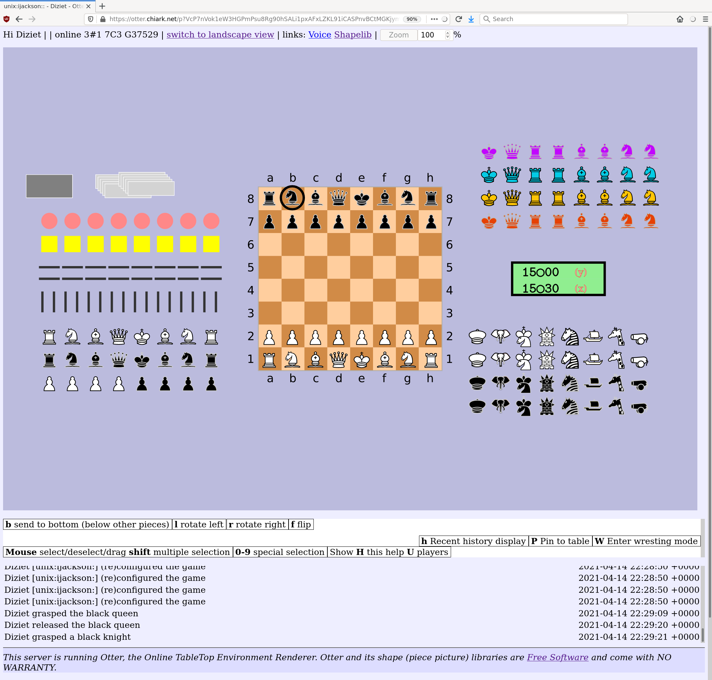
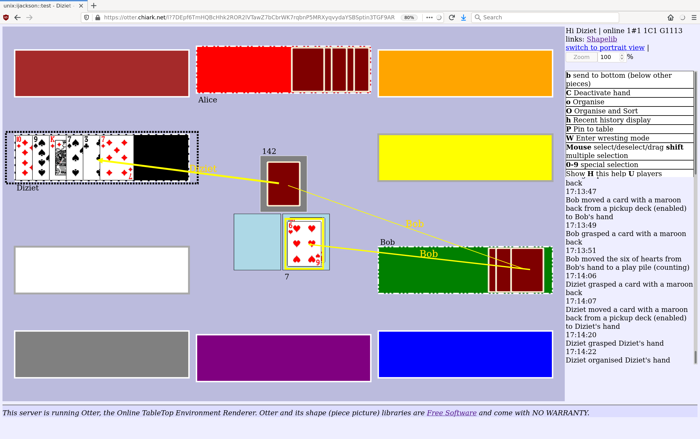

Using Otter as a player or game host
====================================

Basics; joining a game
----------------------

To join a game, you run a command like this on the server host:

::

  otter [--nick <nick>] join-game unix:ijackson::test
                                       /^^^^^^^  ^^^^\
                             game owner             game name


This will print a URL.  You cut and paste that URL into your browser.
It is not usually necessary to explicitly leave a game, although
a ``leave-game`` subcommand is available.

You can have the same URL open in multiple browsers if you wish.  The
browser you use must support JavaScript and WebAssembly.  Cookies are
not used; anyone with your link can see your view of the game.

Game UI
-------

The main Otter UI is fairly sparse and is dominated by the game table
area.  In that area are various elements such as cards, boards, chess
pieces, or whatever.

You can pick up and move those pieces about with the mouse.  When you
move an object (henceforth, a "piece"), everyone else will see it move
too.

Only one player at once may "grasp" a piece.  If you and someone else
both try to manipulate a piece at the same time, only one of your
manipulations will take effect.  For example, if you both try to pick
up and drag a piece right at the same time, whichever of you got to it
last will see the piece "jump" out of your grasp.

But in general different players can manipulate separate pieces (eg,
separate cards) concurrently.

There are two layouts.  You can switch with the controls near the zoom
adjustment.  (What you see will depend on what the game is, of
course.)

Portrait
````````



Landscape
`````````



Keyboard commands and special functions
---------------------------------------

Otter makes use of keyboard commands for many functions.  The UI will
display a list of the currently-valid keyboard commands.  Note that
the set of valid commands can depend on what you have selected, and
what state it is in.


Hidden information - secrets, card shuffling, etc.
--------------------------------------------------

Otter supports what is known in gaming terms as "hidden information".

This is achieved by special "pieces" which are capable of hiding, or
scrambling, other pieces.  In Otter this is called "occultation".

For example, a draw pile deck contains cards but maintains them
shuffled and shows everyone only the backs of the cards.  Each time
anyone draws a card, it is chosen randomly from whatever cards are in
that draw pile.

There are also occulters which treat different players differently.
For example, there are "hand repositories".  When you have "claimed" a
hand repository (with the keyboard command), it becomes "your hand".
Any cards you put in it are identifable only by you.  You see the
fronts of the cards, and their precise positions (and orientations).
The other players see only a simplified view, showing the backs of
cards in predetermined locations.  Another player can select a card
from your hand, but their view of even which card is which is
scrambled, so if they pick a card from your hand they get one selected
at random.

These special occulting pieces need to be activated before they do
their thing.  This is done by selecting the occulter, and issuing
keyboard commands.


UI features
-----------

The UI has a number of features intended to ease play of various
games.  It can be worth experimenting with the UI in a test game, to
see how things work.  The information presented by the game interface
itself is meant as prompts and hints rather than full documentation.

Notable features you might otherwise overlook include these:

Pressing ``h`` repeatedly cycles through various amounts of history
view (the overlaid yellow arrows showing what recently happened).

Typing numbers will get you into a multiple selection mode, which you
can use (for example) to draw yourself a hand of multiple cards.
Typing just ``1`` will let you select the first available card, even if
it's not the one on top (eg because you want to draw a card and
someone is holding onto the deck).

Typing a zero will get you into a special selection mode for selecting
the lowermost piece.  This can useful to grasp a hand or pickup deck
if it is covered in cards so you can't see it.

Hands have an organise function, which lets you neaten the layout of
the cards, or even sort them.  Select the hand and look for the ``o``
and ``O`` keyboard commands.

There is a Wresting mode for making exceptional changes to the game
state, such as forcibly grasping a piece out of another player's
grasp, or moving the chessboard.  Don't forget to exit Wresting mode
when you're finished with it.


Bugs and errors
---------------

Sometimes, bugs can cause things to mess up; in particular, you can
see error messages on the screen in your browser.  They typically
appear at the top, and they say "reloading may help".

If this happens, do try simply reloading the page in your browser.
Typically this will improve matters.  Hopefully the game state on the
server side is not too badly affected.

If you can reproduce a bug, please file a bug report;
https://salsa.debian.org/iwj/otter/-/issues/new .

Of course you might want to reload the Otter game page if you have
trouble with your network or web browser.  The state is all on the
server, so you can reload or reconnect whenever you like.


Game administration
-------------------

Creating and modifying games is done via the ``otter`` command line
utility.  See its ``--help`` message for full details.

The most usual game-creation command looks something like this:

::

  otter reset --reset-table local-users unix:ijackson::test demo
                           /^^^^^^^^^^^ /^^^^^^^^^^^^^^^^^' '^^^\
                           `table spec  `game name     game spec'

Here ``local-users`` refers to the file ``local-users.table.toml`` in the
Otter specs directory (``/volatile/Otter/specs`` on chiark).  The table
spec file handles access control (and some other global properties)
This particular file says that all local shell account users may join
the game.

``demo`` refers to the file ``demo.game.toml``.  The "game spec" says what
shape the table is and what pieces there are.  This is a simple demo game.

Currently there are also ``penultima`` and ``mao`` game specs.

After a game has finished and you want to play again, you can put
everything back to the starting state (or, even, the starting state
for a different game) with something like this:

::

  otter reset unix:ijackson::test demo
             /^^^^^^^^^^^^^^^^^^' '^^^\
          game name                   game spec

The ``otter`` command line tool has further subcommands for
adding/removing players, for ad-hoc addition of pieces from the
library to an existing game, and so on.
